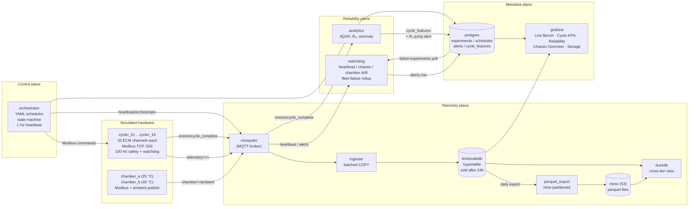

# Battery Lab Simulator

[](https://github.com/jmcmeen/battery-lab-sim/actions/workflows/ci.yml)

Dockerized digital twin of a battery R&D lab. **16 simulated cyclers × 32 channels = 512 cells** cycling continuously across two thermal chambers (chamber A: LCO at 25 °C, chamber B: NMC at 45 °C; silicon-carbon anode variants of both), generating billions of rows of realistic time-series telemetry through a hot tier (TimescaleDB) and a cold tier (Parquet on MinIO), queryable cross-tier from one DuckDB session.

**Built to be broken on purpose.** Failure injection — kill the orchestrator, partition the network, fill the disk — is a first-class feature, and the system survives it: a separate watchdog service writes durable alerts on observable failures while hardware-level safety in each cycler container halts cells autonomously when the orchestrator goes silent.

See [CLAUDE.md](CLAUDE.md) for architectural invariants, [docs/walkthrough.md](docs/walkthrough.md) for a guided demo, and [docs/dashboards.md](docs/dashboards.md) for the Grafana panel inventory.

## Reading order

Start with this README. For the architectural invariants and the constraints every PR must respect, read [CLAUDE.md](CLAUDE.md). For a guided tour of the system in operation, read [docs/walkthrough.md](docs/walkthrough.md). For the chaos engineering story, read [docs/chaos.md](docs/chaos.md). For the full schema reference (Postgres + TimescaleDB + Modbus register map), read [docs/SCHEMA.md](docs/SCHEMA.md).

## Quick start

```bash
make install                    # uv sync the workspace
make up                         # bring up infra + 16 cyclers + 2 chambers + ingester + orchestrator + watchdog + parquet_export
make demo                       # 16-channel × 5-cycle smoke test on cycler_01
                                # Grafana is provisioned by `make up` → http://localhost:3000 (anonymous Viewer)
make duckdb                     # cross-tier query shell (hot + cold)
make duckdb.query Q="SELECT count(*) FROM telemetry_all"
make soak.start                 # start a soak (default schedule: soak_25c_lco; override via SCHEDULE=, e.g. SCHEDULE=phone_fastcharge_nmc)
make soak.status                # per-experiment cycles_done summary
make soak.stop                  # mark all running soak experiments completed
make smoke                      # one-shot health check: services + telemetry + experiments + cycle_features + cross-tier rows
make test                       # unit + integration tests (testcontainers)
make bench                      # ingest throughput benchmark (~45 s wall, asserts the 5,120 rows/s floor)
make chaos.powerfail            # keystone failure-injection demo (kill orchestrator → assert clean recovery)
make test.chaos                 # automated chaos suite (powerfail + kill_cycler + kill_db) ~90s wall
make logs SVC=cycler_01
make tsdb                       # psql against telemetry DB
make psql                       # psql against metadata DB
make minio                      # MinIO console hint (browser http://localhost:9001)
```

## Layout

```
libs/batterylab/                # shared Python package: cell physics, schedules, modbus map, sim time
services/
  cycler/                       # multi-channel cycler (cell + Modbus server + 100 Hz safety loop + telemetry)
  chamber/                      # thermal chamber service (Modbus setpoint + ambient publisher)
  ingester/                     # MQTT → TimescaleDB COPY
  orchestrator/                 # YAML schedule executor with idempotent resume
  watchdog/                     # heartbeat / chassis / chamber monitors → alerts table + MQTT
  parquet_export/               # daily TSDB → MinIO Parquet exporter (Hive-partitioned)
  analytics/                    # cycle-feature engineering (capacity, CE, R₀, dQ/dV) + R₀-jump anomaly detection
grafana/
  provisioning/                 # YAML-provisioned datasources + dashboard provider
  dashboards/                   # Live Bench, Cycle KPIs, Reliability, Chassis Overview, Storage
schedules/                      # version-controlled YAML test schedules
migrations/{timescale,postgres}/  # SQL DDL, applied by scripts/apply_migrations.sh — see docs/SCHEMA.md for the full schema reference
scripts/                        # migration apply, health checks, smoke + soak runners, schedule validator, DuckDB CLI image
chaos/                          # failure-injection scripts (kill orchestrator/cycler/db, partition, packet loss)
tests/{unit,integration,chaos,bench}/  # chaos suite runs against a live `make up` stack; bench uses testcontainers
CLAUDE.md                       # architectural invariants, conventions, common-task recipes, gotchas
CONTRIBUTING.md                 # dev setup, test commands, PR process
SECURITY.md                     # vulnerability reporting + scope
CODE_OF_CONDUCT.md              # Contributor Covenant v2.1
docs/                           # design rationale, schema, walkthrough, dashboards, chaos, migrations, performance, architecture diagram
```

## Architecture



(Also available as [docs/architecture.svg](docs/architecture.svg) for non-Mermaid viewers.)

**Four lanes:**
- **Control** — orchestrator drives cyclers via Modbus. Idempotent commands, 1 Hz heartbeat, chassis dead-man halts cells if the orchestrator goes silent.
- **Telemetry** — cyclers + chambers → MQTT → ingester → TimescaleDB (hot) → daily Parquet export → MinIO (cold). DuckDB unifies hot + cold for ad-hoc queries.
- **Reliability** — watchdog observes (never actuates), writes durable alerts. Four monitors: orchestrator heartbeat, per-chassis dead-man, per-chamber temperature drift, and a fleet-failure rollup that polls Postgres for bursts of `status='failed'` and emits one critical alert instead of N leaf alerts. Each cycler / chamber container also runs an in-process FD-pressure tripwire (warn at 80 % of `RLIMIT_NOFILE`) and a tmpfs-heartbeat healthcheck — both lessons from the v0.1.7 fleet trip (FD exhaustion in the Modbus accept path driven by Modbus-roundtrip healthchecks). Analytics computes per-cycle features and emits R₀-anomaly alerts.
- **Metadata** — Postgres holds schedules (with git SHA), experiments, cycle_features, and alerts. Strictly separated from telemetry per CLAUDE.md invariant #3.

## What it demonstrates

### Hardware-level safety (not Python-level)
[services/cycler/src/cycler/safety.py](services/cycler/src/cycler/safety.py) runs a 100 Hz V/T/watchdog loop **inside the cycler container, independent of the orchestrator**. `docker kill orchestrator` mid-cycle does not endanger any cell — every active channel halts within 5.5 wall seconds when the chassis dead-man timer trips. CLAUDE.md invariant #1.

### Idempotent resume
The orchestrator can be killed mid-experiment and resumed without duplicate cycles, missing cycles, or unsafe states. [services/orchestrator/src/orchestrator/main.py](services/orchestrator/src/orchestrator/main.py) `_resume_inflight` reads channel state from the cycler on boot, re-issues commands on detected mode drift (with a WARNING), and only fails an experiment on persistent drift across two resume attempts in the same process. The cycler is the actuator; the orchestrator is a requester.

### Durable alerting via the watchdog
[services/watchdog/](services/watchdog/) subscribes to the orchestrator heartbeat MQTT topic, polls each chassis's dead-man status register, and watches per-chamber temperature drift. Each observable failure becomes an `alerts` row in Postgres and a critical alert publishes to `alerts/critical` MQTT. Per CLAUDE.md invariant #10, the watchdog never halts cells — it only alerts.

### Hot + cold storage with cross-tier query
- **Hot tier**: TimescaleDB hypertable, 1-hour chunks, native compression after 24 h, 1-second continuous aggregate ([migrations/timescale/001_telemetry.sql](migrations/timescale/001_telemetry.sql)).
- **Cold tier**: hourly zstd Parquet on MinIO, Hive-partitioned (`year=YYYY/month=MM/day=DD/hour=HH`) for partition pruning. Idempotent exporter tracks every exported hour in a `parquet_exports` table and drops the underlying TSDB chunks once they're fully covered.
- **DuckDB cross-tier**: [scripts/duckdb_init.sql](scripts/duckdb_init.sql) attaches both tiers via `postgres` + `httpfs` extensions and exposes a `telemetry_all` UNION view. One SQL session, billions of rows.

**Sizing.** At 512 channels × 10 Hz = 5,120 rows/sec sustained:

| Window | Rows | Raw | TSDB compressed | Parquet (zstd) |
|---|---|---|---|---|
| 1 hour | 18.4 M | 1.5 GB | 180 MB | 130 MB |
| 24 hours | 442 M | 35 GB | 4 GB | 3 GB |
| 60 hours (full soak) | 1.1 B | 88 GB | — (mostly cold) | ~7 GB cold + 4 GB hot |

A laptop with 50 GB free disk hosts the full 60-hour soak comfortably.

### Schedules are code
YAML test schedules live in [schedules/](schedules/), are validated via Pydantic at run time, and every row in `experiments` records the schedule's git SHA — full reproducibility from row to commit. **12 shipped schedules** with a chemistry suffix on every filename (`_lco`, `_nmc`): baseline soak / cycle-life / demo in both chemistries (chamber A LCO, chamber B NMC); elevated-T accelerated NMC aging at 45 °C; plus four phone-realistic patterns — multi-stage step-charge `phone_fastcharge_{lco,nmc}` (the actual 2C → 1.5C → 1C profile every flagship phone uses, not flat CC-CV) and 168-hour calendar-aging `phone_calendar_45c_{lco,nmc}` (the silent killer in phones left plugged in overnight). Si-C anode variants (`NMC+SiC`, `LCO+SiC`) are first-class chemistries with chemistry-bounded charge-rate caps applied by the orchestrator.

### Streaming cycle analytics
[services/analytics/](services/analytics/) subscribes to the orchestrator's `events/cycle_complete` MQTT topic. On each event it queries TSDB for the cycle's telemetry, computes capacity (Coulomb counting), Coulombic efficiency, peak temperature, internal resistance R₀ (from the CC→CV current step), and Severson-style dQ/dV peaks. One row per `(experiment_id, cycle_index)` lands in the `cycle_features` Postgres table — small, dashboard-ready. When R₀ jumps cycle-over-cycle by more than the configurable `ANALYTICS_R0_JUMP_THRESHOLD_PCT`, the service writes a `warning`-severity alert with `source='analytics.anomaly'` so the Reliability dashboard's dedicated R₀-jump panel surfaces the cell.

### Chaos engineering as a first-class feature
[chaos/](chaos/) ships failure-injection scripts that exercise the resilience invariants. The keystone — `make chaos.powerfail` — kills the orchestrator mid-cycle, asserts every active channel tripped to a safe state, asserts no cell breached V_max/T_max during the outage, restarts the orchestrator, and asserts the system returned to a clean state. `make chaos.kill_cycler` proves blast-radius containment (one cycler dies, the other 15 keep working). `make chaos.kill_db` proves the ingester reconnects after a TimescaleDB outage. All three run as `make test.chaos` regression tests in ~90 s wall against a live `make up` stack. See [docs/chaos.md](docs/chaos.md).

### Grafana Dashboards
Auto-provisioned, no clicking:
- **Live Bench** (1 s refresh) — heatmaps for V, I (implied via current_a in telemetry), T, SOC across all 512 channels.
- **Cycle KPIs** (5 s) — voltage trajectory, step durations, peak T per cycle, capacity vs cycle, SOH fade, dQ/dV peak shift.
- **Reliability** (5 s) — alert log, critical-alert count, telemetry freshness, watchdog trips by chassis. The dashboard you watch during the chaos demo.
- **Chassis Overview** (5 s) — per-chassis status table across all 16 chassis with running/failed/completed counts, schedule, max cycle, 24h alerts; chamber A/B temperature spread.
- **Storage** (30 s) — hot tier (TSDB hypertable size, chunks, retention) + cold tier (Parquet files, rows, bytes, last export age) + Postgres metadata. Ingest-rate timeseries. Chunk and Parquet-file inventory tables.

See [docs/dashboards.md](docs/dashboards.md) for the per-panel SQL.

## Tests

```bash
make test.unit                  # fast, no I/O — Hypothesis property tests, cross-source schema-alignment guard, ECM/aging/Modbus examples
make test.integration           # real testcontainers (Mosquitto, Postgres, TimescaleDB, MinIO, Grafana, real cycler chassis)
make test.chaos                 # chaos suite, ~90 s wall, requires `make up` first
make bench                      # ingest throughput floor (~45 s wall, asserts 5,120 rows/s — see docs/performance.md)
make lint                       # ruff + mypy
```